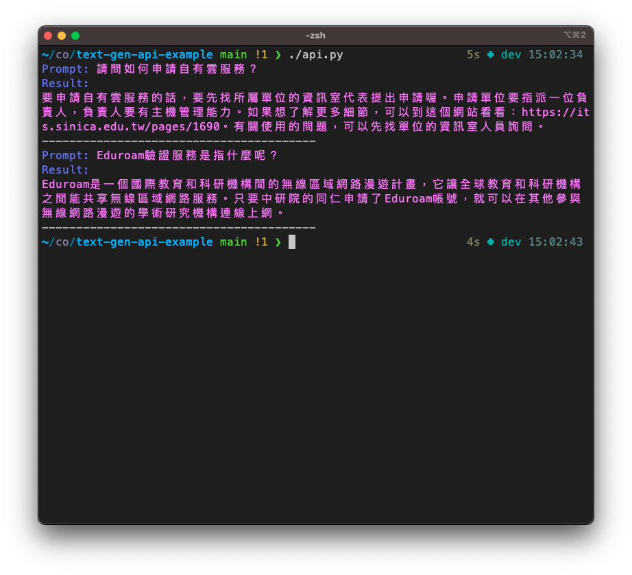

# AS-AIGFAQ API

## Introduction

Here is TAIDE model trained on a dataset from [AS-AIGFAQ](https://github.com/AS-AIGC/AS-AIGFAQ) API example

the following python program `./api.py` that support user directly interact with the API.

## How-to-use

1. Replace the examples
2. Execute `api.py`
3. Wait for the result

